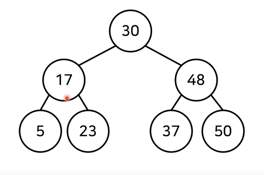
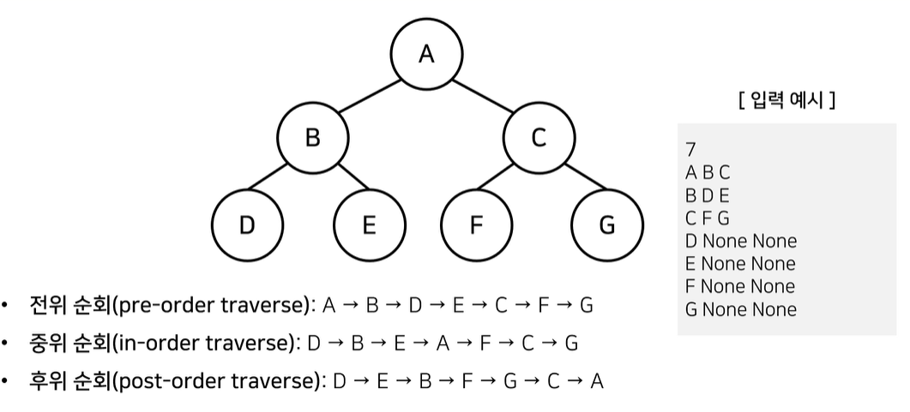

## 트리 (Tree)

- 트리는 가계도와 같은 계층적인 구조를 표현할 때 사용할 수 있는 자료구조

  루트 노드(root node): 부모가 없는 최상위 노드

  단말 노드(leaf node): 자식이 없는 노드

  크기(size): 트리에 포함된 모든 노드의 개수

  깊이(depth): 루트 노드로부터의 거리

  높이(height): 깊이 중 최댓값

  차수(degree): 각 노드의 (자식방향) 간선 개수

- 기본적으로 트리의 크기가 N이라면, 전체 간선의 개수는 N-1개이다.

## 이진 탐색 트리 (Binarty Search Tree)

- 이진 탐색이 동작할 수 있도록 고안된 효율적인 탐색이 가능한 자료구조의 일종

- 이진 탐색트리의 특징: 왼쪽 자식노드 < 부모노드 < 오른쪽 자식노드

  부모 노드보다 왼쪽 자식노드가 작고, 부모노드보다 오른쪽 자식노드가 크다.

  

- 어떻게 데이터를 조회하는가? (위의 이진 탐색 트리에서 37을 찾고싶을때)

  1. 루트 노드부터 방문하여 탐색을 진행함

     1)현재 노드와 찾는 원소 37을 비교

     2)찾는 원소가 더 크므로 오른쪽 노드로 이동함

  2. 현재 노드와 값을 비교함 

     1)현재 노드와 찾는 원소 37을 비교

     2) 찾는 원소가 더 작으므로 왼쪽 노드로 이동함

- 이상적인 경우 O(logN) 시간 복잡도를 가짐

### 트리의 순회

- 트리 자료구조에 포함된 노드를 특정한 방법으로 한번씩 방문하는 방법

  - 트리의 정보를 시각적으로 확인할 수 있음

- 대표적인 트리 순회 방법은 다음과 같다

  1.전위 순회(pre-order traverse): 루트를 먼저 방문하는 방법

  2.중위 순회(in-order traverse): 왼쪽 자식을 먼저 방문한 뒤에 루트를 방문

  3.후위 순회(post-order traverse): 오른쪽 자식을 먼저 방문한 뒤에 루트를 방문

  

  

### 파이썬에서 트리의 순회 구현

- class Node: 를 만들어서 데이터를 저장할 self, 그리고 양쪽 자식노드를 생성

  #### 추가예정

  

